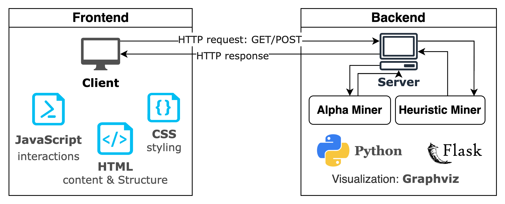
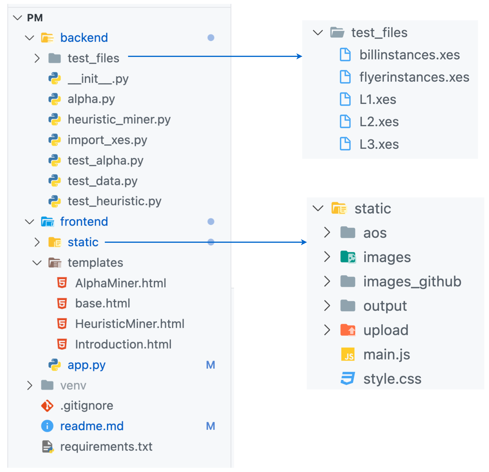
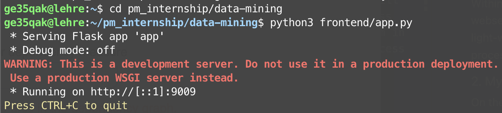
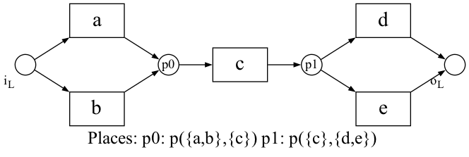
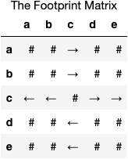
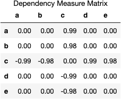
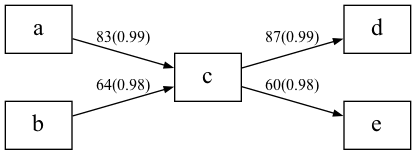
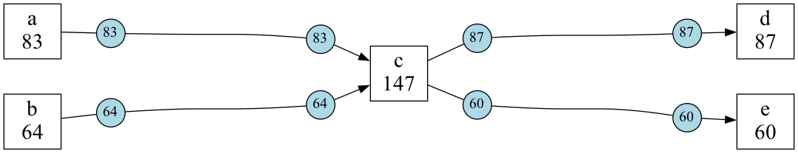

## Practical Course Introduction to Process Mining with Implementation of a Webservice (IN00012)

### 1. Problem Statement
The course aims to enable students to understand, implement and visualize process discovery algorithms.
Within this practical course students will implement a webservice to provide process discovery results in a light-weight form in order to facilitate the analysis of process execution data for non-technical experts. 


### 2. My Implementation
On the one hand, I implement two process mining algorithms: Alpha miner and Heuristic miner, which are the core of my backend implementation. On the other hand, I develop a webservice where users can upload an XES file and get back a process model.

#### 2.1 Final Satus 19.01.2023
##### Alpha miner
* fully implemented and unit tests for the first 5 steps passed
* Additional functionality implemented: footprint matrix as png image
##### Heuristic miner
* fully implemented and unit tests for the first 5 steps passed
* Additional functionality implemented: causal net and dependency measure matrix as png image, input/output bindings
  
##### Flask app
* works as expected on local machine as well as on the chair server
* Additional functionality implemented: dark/light mode, hamburger toggle button for nav bar when browser windows are small, back-to-top button, animation-on-scroll, local storage of user's preference
 


#### 2.2 Technologies Used
* **Backend**: [Python 3.11.0](https://www.python.org/downloads/), [pm4py 2.2.32](https://pm4py.fit.fraunhofer.de/) and [Flask 2.2.2](http://flask.pocoo.org/) - A microframework for Python.
* **Frontend**: HTML, CSS and JavaScript
* **Source Code Editor / IDE**: Visual Studio Code 1.74.3
* **Visualization**: [graphviz 0.20.1](https://graphviz.org/), [dataframe-image 0.1.3](https://github.com/dexplo/dataframe_image)
* All the above are used together on MacOS 12.2.2

#### 2.3 For what did I apply these technology?
* **Python**: implement the backend algorithms, xes parser and unit tests
* **pm4py**: library for reading an xes file into a list of dictionary
* **Flask**: implements the web application, handles http requests and calls algorithms from backend
* **HTML**: formulates the contents of the webpage and specifies structures
* **CSS**: styles the webpage and beautifies visualization
* **JavaScript**: implements some interactions on the webpage, including back-to-top button, navgation bar hides into a  hamburger button for smaller windows, dark/light mode toggle
* **grahviz**: draws the Petri net, dependecy graph and causal net and exports them to .png images
* **dataframe-image**: converts footprint matrix and dependency measure matrix to a table and exports them to .png images
* **Visual Studio Code**: writing source codes, testing, making good folder structure

#### 2.4 Interaction Model

<p align="center">
  
  <br>
    <em>Interaction between frontend and backend</em>
</p>

In the frontend, the user will upload an xes file in a browser(client). Then the file will be saved in frontend/static/upload folder by the flask app. In the backend, the flask app will call one of the algorithms to process the uploaded file. The resulting process model will be saved as a png image in frontend/static/output folder. Lastly, the flask app displays the process model in the browser. 

### 3. Project Structure


#### some Import files/folders to mention:
* alpha miner corresponds to alpha.py
* heuristic miner corresponds to heuristic_miner.py
* test_files stores the given 11 xes files and are solely for testing heuristic miner
* test_data.py stores static event log data extracted from the 11 xes files and are used for testing both algorithms
* app.py is the main application


### 4. Installlation

#### 4.1 Install locally
Firstly create a folder, for example 'PM'. Then open your command line tool / terminal / prompt, then execute the following line:
```
git clone https://github.com/Fansadventure/Proces-Mining.git
```
You might need to enter your user name and password for gitlab.lrz.de.
Then install all packages for this web application:
```
pip3 install -r requirements.txt   
# or 
pip install -r requirements.txt  
```
The library graphviz rendering also needs the software Grahviz installed. Otherwise it will complain with this error: graphviz.backend.execute.ExecutableNotFound. To install the software, run this command:
```
brew install graphviz
```

#### 4.2 Install on server

**For my tutor**: You don't need to install anything on the chair's server. I already installed my application there. 

For those who wants to use my application on your server, I can show you how I did it. You can just follow the steps below.

##### Step 1. connect to the server from my terminal:
```
ssh ge35qak@lehre.bpm.in.tum.de
```
##### Step 2. enter the passphrase for key '/Users/fan/.ssh/id_rsa'

##### Step 3. clone the repository just like on a local machine:
```
git clone https://github.com/Fansadventure/Proces-Mining.git
```

##### Step 4. enter my username and passwords for gitLab

##### Step 5. install all required packages:
```
pip3 install -r requirements.txt 
```


### 5. Run the project
#### 5.1 On remote server
In terminal, go to the data-mining folder and run the app.py
```
cd pm_internship/data-mining
python3 frontend/app.py
```
Then the message is displayed:



Since the app is running at port 9009, now you can go to the follwing link to try my algorithms with your xes files.
```
https://lehre.bpm.in.tum.de/ports/9009//alpha_miner
https://lehre.bpm.in.tum.de/ports/9009//heuristic_miner
```
You can explore introduction info as well as the addtional functionalities mentioned in 2.1 at:
```
https://lehre.bpm.in.tum.de/ports/9009//
```
#### 5.2 On local machine
Go to the frontend folder and run the app.py
```
python3 app.py
```

### 6. Usage of source codes
Both Alpha and Heuristic miner take an xes file as input. Alpha miner outputs a Petri net and Heuristic miner outputs a dependency graph as well as a Causal net.

The output matrix and graph will be stored at frontend/static/output.

#### 6.1 Alpha Miner 
Draw a Petri net:
```python
import alpha 
import import_xes as parser

event_log = parser.importer().read_xes("test_files/L4.xes") # parse an xes file
alpha.draw_petri_net(event_log)
```
Output:



Generate footprint matrix from the event log:
```
alpha.footprint_matrix(event_log)
```
Output:



Explore intermediate results:

Please refer to alpha.py

#### 6.2 Heuritic Miner

```python
import heuristic_miner as hm
import import_xes as parser

event_log = parser.importer().read_xes("test_files/L4.xes") # parse an xes file
```

Calculate dependency measures:

```python
dm = hm.denpendency_measure(event_log)
print(dm)
```
Output:
{(a, c): 0.99, (c, d): 0.99, (b, c): 0.98, (c, e): 0.98}

```python
# generate a dependency measure matrix as a png file:
hm.dm_matrix(event_log)
```
Output:



Draw a dependency graph and Causal net: 
```python
# threshold values are given by user, 0 by default.
hm.draw_denpendencyGraph(event_log, threshold_df=0, threshold_dm=0.0) 
hm.draw_cnet(event_log)
```

Output:

Depedency Graph: &nbsp;&nbsp;


C net: &nbsp;&nbsp;



<br>

### 7. Acknowledgement
I would like to express my deepest appreciation to my tutor Ms. Catherine Sai, who provides me with extremly useful information and support along the way.


### 8. Helpful links
#### Introduction videos on process mining:
[BPI Course - An introduction to Process Mining](https://www.youtube.com/playlist?list=PLG_1ZxIPXO0uA-LolJSQH2jzJ8oUiq9hu)
given by prof.dr.ir. Wil van der Aalst.

#### References
[[1] W.M.P. van der Aalst, Process Mining: Data Science in Action](https://link.springer.com/book/10.1007/978-3-662-49851-4)  <br>
[[2] Workflow mining: discovering process models from event logs](https://ieeexplore.ieee.org/abstract/document/1316839)


#### Data sources for more log files
[http://gruppe.wst.univie.ac.at](http://gruppe.wst.univie.ac.at/projects/crisp/index.php?t=discovery) <br>
[Business Process Intelligence (BPI) challenge logs, 4TU Datasets](www.processmining.org)